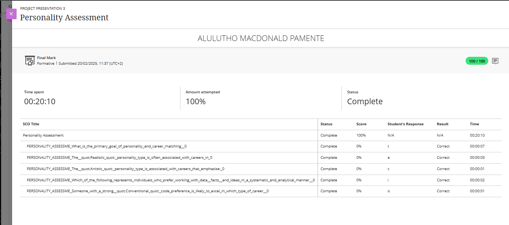

# PRP370S-Digital-Portfolio
Welcome to my digital portfolio showcasing my personal and professional development journey during the Work Readiness Training.
### Evidence

- Summary of insights from the session.

### Reflection: Career Counselling

**S – Situation**  
As part of the Work Readiness Training for PRP370S, I engaged in career counselling activities designed to help me clarify my long-term career goals, evaluate my strengths and values, and begin forming a focused career development plan.

**T – Task**  
My goal was to reflect deeply on my interests, skills, and future aspirations in order to define a realistic career direction and set actionable goals aligned with my personal values and strengths. I needed to make informed decisions about where I wanted to be in 1–3 years and how to get there.

**A – Action**  
I completed various self-assessments, including goal-setting activities that encouraged me to ask: “What do I want to do in three years?” and “What does success look like at the highest level?” I used the SMART framework (Specific, Measurable, Attainable, Relevant, and Time-bound) to turn broad aspirations into practical steps. I also identified skill gaps and outlined actions like learning from structured courses and gaining hands-on experience. These reflections were guided by prompts and best practices shared during the career counselling section.

**R – Result**  
This process helped me define a clearer career vision and create a development plan that includes both short- and long-term goals. I now understand the importance of aligning my career path with my strengths and values, and I feel more confident in the steps I need to take, such as improving communication and technical leadership skills. Career counselling gave me a structured way to navigate my future and the motivation to act on it.

---

##  Skills and Interests

### Evidence

##  Core Skills for a Multimedia Student

###  Design & Creativity
- Visual design principles (color theory, typography, layout)
- Graphic design using Adobe Creative Suite (Photoshop, Illustrator, InDesign)
- Branding and visual storytelling
- UI/UX design (user interface and user experience)

###  Technical & Software Proficiency
- Video editing (Adobe Premiere Pro, Final Cut Pro, After Effects)
- Audio editing (Audacity, Adobe Audition)
- 2D/3D animation (Blender, Adobe Animate)
- Web development basics (HTML, CSS, JavaScript)
- Motion graphics and visual effects

###  Conceptual & Theoretical Knowledge
- Understanding of multimedia communication
- Digital marketing principles
- Media theory and audience analysis
- Content strategy and planning

###  Soft Skills & Collaboration
- Creative problem-solving
- Strong communication skills (visual and verbal)
- Time management and ability to meet deadlines
- Collaboration in team environments
- Adaptability and openness to feedback

### Portfolio Development
- Ability to present and explain design work
- Experience building and maintaining a digital portfolio
- Understanding of file formats, compression, and optimization for digital delivery

---

*These skills form the foundation for a career in graphic design, animation, film production, digital marketing, web design, and other multimedia-related fields.*

### Reflection: Skills and Interests

**S – Situation**  
As part of the Work Readiness Training for PRP370S, I was required to reflect on and document my personal values, interests, and skills in order to understand how they align with potential career paths.

**T – Task**  
The task was to follow a structured framework to analyze my strengths and determine how my interests and skills could be applied in a professional context. This involved identifying values, understanding transferable and job-specific skills, and recognizing achievements.

**A – Action**  
Using the framework provided in the image, I worked through each step:
- I **identified my core values**, such as creativity, independence, and integrity.
- I **recognized my interests**, which include digital design, web development, and technology problem-solving.
- I **understood my transferable skills**, such as communication, teamwork, and attention to detail, developed through academic and group projects like *GoSellin Gourmet*.
- I **defined job-specific skills**, like proficiency in HTML, CSS, JavaScript, PHP, and Adobe Creative Suite.
- Lastly, I **identified key achievements**, such as successfully designing and integrating a secure login system and collaborating to create a seamless online store experience.

**R – Result**  
This process helped me gain a clear understanding of how my strengths and interests align with careers in web development and UI/UX design. It also gave me clarity on what skills I already possess and which ones I need to develop further. As a result, I now feel more confident in targeting career opportunities that are meaningful and well-suited to my abilities.

---

##  Personality Assessment

### Evidence
-

### Reflection: Personality Assessment

**S – Situation**  
During the Work Readiness Training for PRP370S, I participated in a personality assessment activity designed to help students understand how their personal traits align with various career paths.

**T – Task**  
My task was to evaluate my personality using a structured framework, understand how external influences and personality profiling play a role in career decision-making, and determine which personality types align with my interests and career goals.

**A – Action**  
I followed the five-step process shown in the provided personality framework:
- **Identified outside career influences** such as family expectations, social environment, and cultural norms.
- **Understood personality profiling** by taking part in an assessment and learning about tools like the MBTI and Holland’s Six Personality Types.
- **Evaluated my personality** based on how I respond to challenges, communicate, and collaborate with others.
- **Explored the six personality types** and found that I closely align with the Artistic and Investigative types, which suit careers in design, problem-solving, and innovation.
- **Understood the connection** between personality type and career match, realizing that a multimedia or UI/UX design role fits both my traits and passions.

**R – Result**  
This exercise helped me see how deeply personality influences career choices. I now have a clearer sense of which roles will allow me to thrive and stay motivated. The insight gained has helped me refine my career direction, and I’m more focused on opportunities where creativity, autonomy, and meaningful problem-solving are valued.

---

## Creating My CV

### Evidence
- [Link to my CV (Markdown version)](cv.md)
- [My CV (PDF)](media/220280150_CV.pdf)

### Reflection: Creating My CV

**S – Situation**  
As part of the Work Readiness Training for PRP370S, I was required to create a professional CV to showcase my academic background, technical skills, and project experience.

**T – Task**  
My task was to develop a CV that would represent my growth, competencies, and readiness for the ICT industry. It needed to be clear, structured, and tailored to highlight my strengths as a developer and designer.

**A – Action**  
I started by reviewing previous projects, particularly the GoSellin Gourmet PHP group project, where I contributed to both front-end and back-end development. I identified key technical tools and soft skills I had developed, including PHP, HTML, CSS, React, and collaboration. I formatted the CV using a clean structure and later converted it to Markdown to meet the digital portfolio requirements.

**R – Result**  
The result was a professional CV that clearly communicates my technical skills and project experience. It effectively highlights my contributions to real-world work and demonstrates my ability to adapt and collaborate. Through this process, I also improved my ability to present myself in a clear and marketable way.

---

## CV Submission

### Evidence

### Reflection: CV Submission

**S – Situation**  
As part of the final step in the PRP370S Work Readiness Training, I was required to submit my completed CV via the university's Blackboard platform to demonstrate my ability to follow professional submission procedures and meet deadlines.

**T – Task**  
The task was to ensure my CV was well-prepared, formatted using Markdown, and successfully uploaded to Blackboard as evidence of my readiness to present myself in a professional setting.

**A – Action**  
After refining my CV and ensuring all sections reflected my academic background, technical skills, and project experiences, I reviewed the submission requirements. I double-checked the file format, confirmed the accuracy of my details, and uploaded the final version to Blackboard. Once submitted, I saved a copy of the Blackboard submission receipt as evidence.

**R – Result**  
I successfully submitted my CV on time and received confirmation via a submission receipt, which I’ve included below as proof. This step taught me the importance of paying attention to detail, following instructions, and keeping documentation of important processes. It also gave me confidence in presenting myself professionally in future job applications.

## 🔗 Contact

**Cell Phone number**: 0718143268  
**Email**: aluluthopamente78@gmail.com
